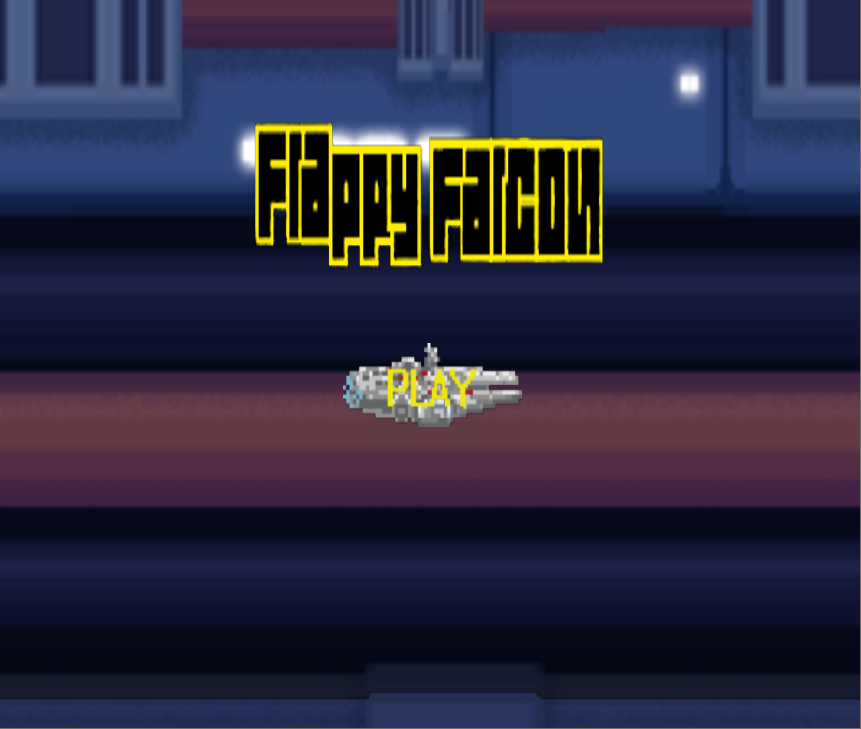
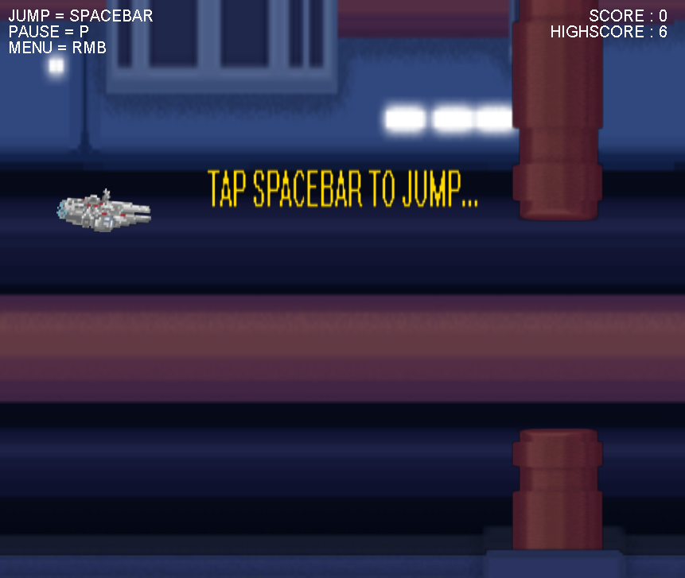
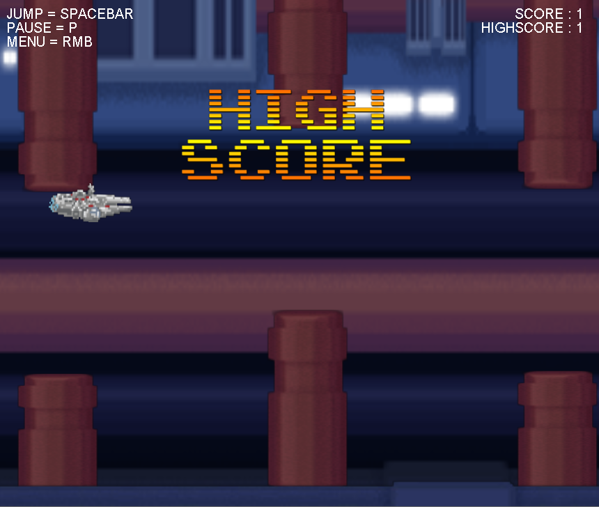
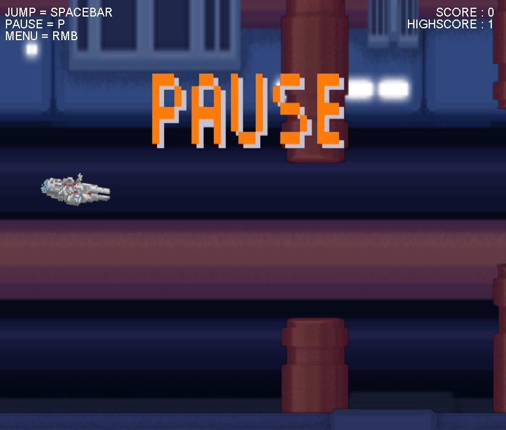
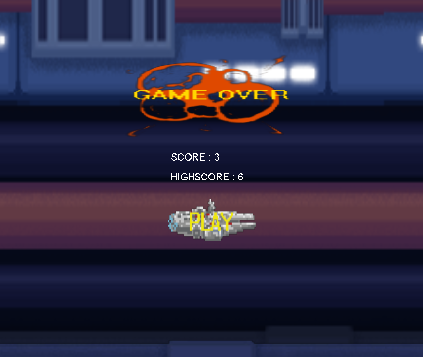

# Flappy Falcon

My first try of game dev. written with help of jogl-2.0 and my friend [xmannm](https://github.com/xmannm), who made those kick-ass star wars looking textures.
If you want to make something with the code you need jogl-2.0 library which was locally added but already lost.
If you want to play it just exec executable .jar file [(Flappy Falcon)](FlappyFalcon.jar). If you dont know how to do that here is a [tutorial](https://www.youtube.com/watch?v=ifBlevULGtM)
to successfully run the game.  

It save your actual score to .txt file so if you run it again you can beat your high score

or you can pause the game.

It has Menu,Game and GameOver screen.

It was originally made as a school project and you could say that it is not written exactly with clean code principles. 
Due to participation on other interesting projects I or [xmannm](https://github.com/xmannm) dont have time to work on this anymore.
Feel free to clone  and do whatever you wish with it.
I hope you will have as much fun playing it or messing with it as we did making it.
